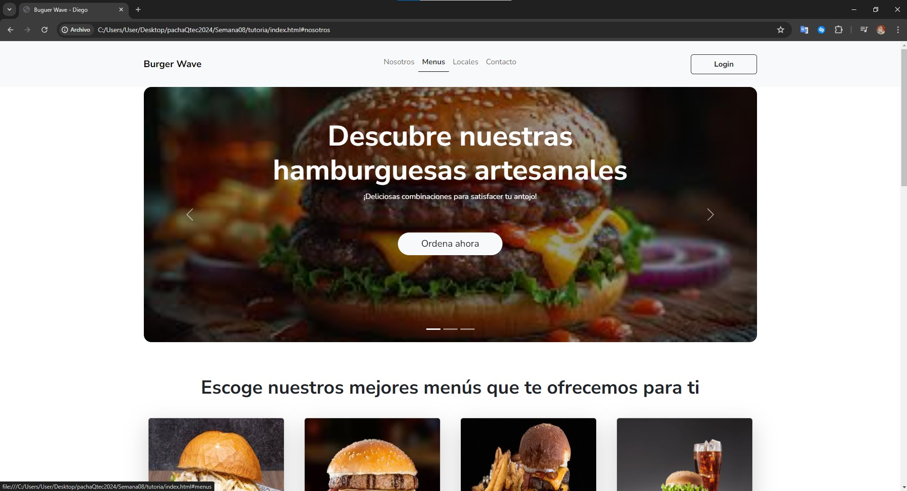

# Bootstrap Proyecto Burguer Wave

Este proyecto consiste en la creación de una página web para un restaurante de hamburguesas llamado Burger Wave adaptado para dispositivos móviles. La página está diseñada utilizando HTML, CSS y Bootstrap.

### Componentes Utilizados de Bootstrap:

- **Navbar:** Se emplea para la barra de navegación en la parte superior de la página. Contiene enlaces a diferentes secciones de la página y un botón de inicio de sesión.

- **Carousel:** Se utiliza para presentar imágenes destacadas de hamburguesas en la página de inicio. Cada diapositiva del carrusel incluye una imagen y texto descriptivo.

- **Cards:** Se usan para mostrar las opciones de menú disponibles. Cada tarjeta contiene una imagen, título, precio y botón de acción.

- **Sections:** Sirven para organizar y dividir el contenido de la página en distintas áreas, como "Nosotros", "Menús", "Locales" y "Contacto".

- **Formulario:** Se utiliza para recopilar información de los clientes interesados. El formulario de contacto incluye campos para nombre, correo electrónico, número de teléfono, detalles del pedido y mensaje.

